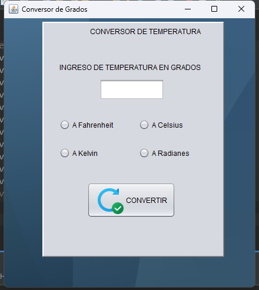
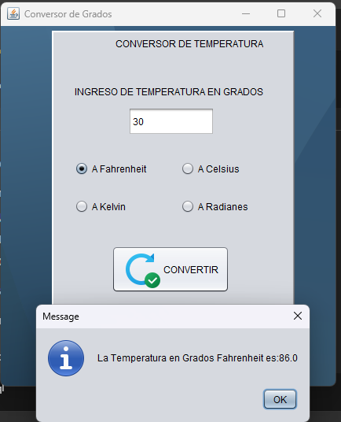
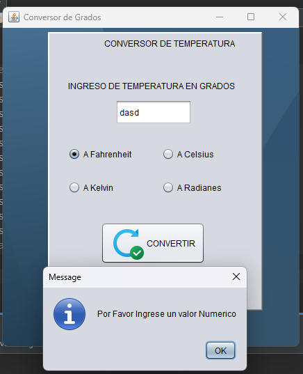
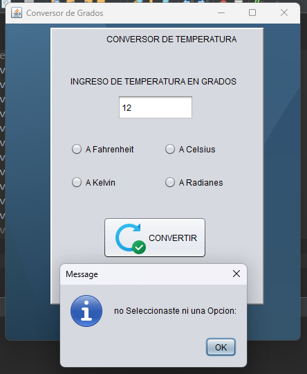

# Java Swing Temperature Converter

Proyecto académico desarrollado en **Java Swing** como parte de la  
**Tecnicatura en Desarrollo de Software – Universidad de La Punta**.

El proyecto implementa una aplicación de escritorio para convertir
temperaturas entre distintas unidades, aplicando lógica condicional,
manejo de eventos y validación de datos.

---

## 🚀 Descripción

Aplicación de escritorio que permite ingresar un valor numérico de temperatura
y convertirlo a diferentes unidades mediante opciones seleccionables
(RadioButtons).

El objetivo del proyecto es reforzar conceptos básicos de Java,
interfaces gráficas, estructuras de control y manejo de errores.

---

## 🛠️ Tecnologías utilizadas

- Java
- Java Swing
- NetBeans IDE

---

## 🔧 Funcionalidades

- Ingreso de temperatura por teclado
- Conversión a:
  - Fahrenheit
  - Celsius
  - Kelvin
  - Radianes
- Selección de conversión mediante `JRadioButton`
- Validación de entrada numérica
- Manejo de excepciones (`try-catch`)
- Mensajes de error y resultados con `JOptionPane`

---

## 🖼️ Capturas de la aplicación

### 🔢 Interfaz principal

Pantalla principal del conversor con campo de entrada y opciones de conversión.



---

### ✅ Conversión exitosa

Ejemplo de conversión correcta con resultado mostrado al usuario.



---

### ❌ Error de entrada

El sistema detecta valores no numéricos y muestra un mensaje de advertencia.



---

### ⚠️ Opción no seleccionada

Mensaje mostrado cuando el usuario no selecciona ninguna opción de conversión.



---

## ▶️ Cómo ejecutar el proyecto

1. Clonar el repositorio:
   ```bash
   git clone https://github.com/owengmz/java-swing-temperature-converter.git
   ```
2. Abrir el proyecto en NetBeans IDE.

3. Compilar y ejecutar la clase principal:
   grados.java
